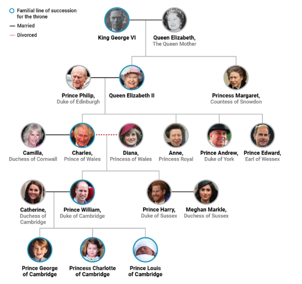

## House of Windsor

## Example Queries

- Who are Anne's two nephews?
<pre>
?- siblings_of(anne, Sibling), parent_of(Newphew, Sibling).
Sibling = charles,
Newphew = william ;
Sibling = charles,
Newphew = henry ;
false.
</pre>

- Who is the grandfather of William?
<pre>
?- parents_of(william, Father, _), parents_of(Father, Grandfather, _).
Father = charles,
Grandfather = philip.
</pre>

- Who are the siblings of the ancestors of William?
<pre>
?- ancestor_of(william, Ancestor), siblings_of(Ancestor, Sibling).
Ancestor = charles,
Sibling = anne ;
Ancestor = charles,
Sibling = andrew ;
Ancestor = charles,
Sibling = edward ;
Ancestor = elizabeth-ii,
Sibling = margaret ;
false.
</pre>

- Determine how many descendants Philip has.
<pre>
?- aggregate_all(count, ancestor_of(_, philip), Count).
Count = 10.
</pre>